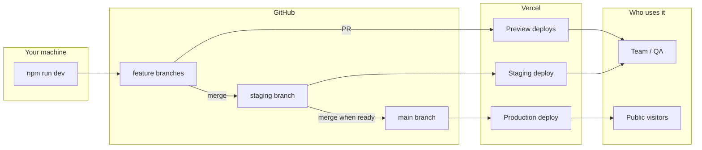

# Deployment Pipeline — Production & Staging

**Project:** Leadora Systems landing page  
**Stack:** GitHub → Vercel → Hostinger DNS (production domain later)  
**Form data:** Google Sheets (Apps Script)

---

## 1. Big picture



| Layer | What it is |
|-------|------------|
| **Local** | `npm run dev` on your PC — fastest feedback, uses `.env.local` |
| **Staging** | Shared “almost production” site for testing before go-live |
| **Production** | Live site for real users (custom domain when you connect Hostinger) |
| **Preview** | Automatic temporary URL per branch/PR (bonus, not a third “environment” you manage daily) |

You asked for **2 environments** (production + development/staging). In practice you get:

1. **Production** — `main` branch  
2. **Staging** — `staging` branch (stable staging URL)  
3. **Preview** (optional) — every PR / feature branch (Vercel default)

---

## 2. Git branches (source of truth)

| Branch | Purpose | Who merges | Deploys to |
|--------|---------|------------|------------|
| `main` | Live production code | Only after staging looks good | **Production** on Vercel |
| `staging` | Pre-release testing | Feature work merges here first | **Staging** URL on Vercel |
| `feature/*` | One task (e.g. `feature/contact-form-fix`) | Developer | **Preview** URL (auto) |

### Rules

- Never push broken code directly to `main`.
- Flow: `feature/*` → PR → `staging` → test → PR → `main`.
- Hotfix exception: urgent production fix can branch from `main` → fix → merge to `main` and back-merge to `staging`.

### Create `staging` branch (one time)

```bash
git checkout main
git pull origin main
git checkout -b staging
git push -u origin staging
```

---

## 3. Vercel environments (map to your branches)

Open: **Vercel → your project → Settings**

### 3.1 Production

| Setting | Value |
|---------|--------|
| **Production Branch** | `main` |
| **Domain** (later) | `leadorasystems.com`, `www.leadorasystems.com` |
| **URL now** | `landing-page.vercel.app` (or similar) |

Every push/merge to `main` triggers a **production deployment**.

### 3.2 Staging (development / pre-production)

Two parts:

**A) Branch deploy**  
- Pushes to `staging` create a deployment.  
- URL looks like: `landing-page-git-staging-<team>.vercel.app`

**B) Stable staging domain (recommended when ready)**  
- **Settings → Domains** → Add `staging.leadorasystems.com` (or `dev.leadorasystems.com`)  
- Assign domain to **Git branch:** `staging`  
- In **Hostinger DNS**, add the CNAME record Vercel shows (only when you want staging on your domain; otherwise use the `.vercel.app` URL)

### 3.3 Preview (automatic)

- Opening a **Pull Request** on GitHub → Vercel comments with a **Preview URL**.  
- Pushing to any branch that is not Production Branch → preview deploy.  
- Use for code review; no extra setup.

### 3.4 Local development

- Not a Vercel environment.  
- Run `npm run dev` + `.env.local`.

---

## 4. Environment variables (per environment)

**Settings → Environment Variables** in Vercel. Scope each variable:

| Variable | Production | Preview | Development |
|----------|:----------:|:-------:|:-----------:|
| `GOOGLE_SHEETS_WEB_APP_URL` | ✓ | ✓ | optional |
| `GOOGLE_SHEETS_SECRET` | ✓ | ✓ | optional |
| `NEXT_PUBLIC_SITE_URL` | `https://leadorasystems.com` | staging/preview URL | `http://localhost:3000` |

**How to assign in Vercel UI**

- Click **Add** on each variable.  
- Check **Production** only for production values.  
- Check **Preview** for staging + PR previews (same staging sheet URL is OK).  
- **Development** = `vercel dev` locally (optional).

### Google Sheets tip

| Approach | When |
|----------|------|
| **Same spreadsheet**, staging forms tagged in script | Simple MVP |
| **Second spreadsheet** + second Apps Script URL for Preview | Avoid test rows in production sheet |

For MVP: use one sheet; add a `environment` column in Apps Script (`staging` / `production`) if you want to filter rows later.

---

## 5. End-to-end deployment flow (day to day)

### Starting a new feature

```bash
git checkout staging
git pull origin staging
git checkout -b feature/my-change
# edit code, test locally: npm run dev
git add .
git commit -m "feat: describe change"
git push -u origin feature/my-change
```

1. Open **PR on GitHub**: `feature/my-change` → `staging`  
2. Vercel adds **Preview URL** on the PR — share with team, click through site, test forms.  
3. Review code → **Merge PR** into `staging`.  
4. Vercel deploys **staging** branch → open staging URL, full regression (all pages, contact, careers, mobile).

### Releasing to production

1. Open **PR on GitHub**: `staging` → `main`  
2. Final check on staging URL.  
3. **Merge** into `main`.  
4. Vercel **production** deploy starts automatically.  
5. Verify production URL (and custom domain when DNS is linked).  
6. Check Google Sheet for a test submission on production if you changed forms.

### Emergency rollback

- **Vercel → Deployments →** find last good production deployment → **⋯ → Promote to Production** (instant rollback).  
- Or revert commit on `main` and push (triggers new deploy).

---

## 6. What runs on each deploy (CI/CD)

Vercel runs this automatically (no extra server):

| Step | Command (conceptually) | Fail if |
|------|------------------------|---------|
| Install | `npm install` | dependency error |
| Build | `next build` | TypeScript/compile error |
| Deploy | Upload to CDN + serverless functions | build output invalid |

### Optional: GitHub Actions (stricter gate)

Add `.github/workflows/ci.yml` later to run **before** merge:

- `npm run lint`  
- `npm run build`  

Vercel still deploys; Actions block merging if checks fail (branch protection).

---

## 7. DNS & domains (when you are ready)

| Environment | Domain example | Where to configure |
|-------------|----------------|-------------------|
| Production | `leadorasystems.com` | Vercel Domains + Hostinger DNS → `main` |
| Staging | `staging.leadorasystems.com` OR `*.vercel.app` | Vercel Domains → branch `staging` |
| Preview | `*.vercel.app` | Automatic |
| Local | `localhost:3000` | — |

See `docs/hostinger-dns-vercel.md` for Hostinger steps. **Do not remove MX records** if email stays on Hostinger.

---

## 8. Vercel dashboard checklist (do once)

- [ ] GitHub repo connected (`Landing-Page`)  
- [ ] **Production Branch** = `main`  
- [ ] Create & push `staging` branch on GitHub  
- [ ] Env vars set for **Production** and **Preview**  
- [ ] (Optional) Add `staging.leadorasystems.com` → branch `staging`  
- [ ] (Later) Add production domain → branch `main` + Hostinger DNS  
- [ ] Enable **Deployment Protection** on production if you want (Vercel Pro) — optional  

### GitHub recommendations

- [ ] **Settings → Branches → Branch protection** on `main`: require PR, no direct push  
- [ ] Same for `staging` if you want (optional)  

---

## 9. Roles & responsibilities

| Role | Staging | Production |
|------|---------|------------|
| Developer | Merge features → `staging`, test preview URLs | Merge `staging` → `main` after approval |
| QA / PM | Test staging URL + PR previews | Smoke test after prod deploy |
| You (owner) | Approve PR to `main` | Connect domain, env vars, rollback if needed |

---

## 10. Quick reference commands

```bash
# Local
npm run dev

# Sync before new work
git checkout staging && git pull
git checkout -b feature/xyz

# After merge to staging — Vercel deploys automatically
# After merge to main — production deploys automatically

# See remote branches
git branch -a
```

---

## 11. Troubleshooting

| Problem | Fix |
|---------|-----|
| Staging deploy not happening | Confirm branch `staging` exists on GitHub and you pushed to it |
| Forms work locally, fail on Vercel | Env vars missing for **Production** or **Preview** — redeploy after adding |
| Wrong site URL in metadata | Fix `NEXT_PUBLIC_SITE_URL` for that environment, redeploy |
| Production shows old code | Check latest deployment on `main` is **Ready** and promoted |
| Test data in production sheet | Use separate sheet URL for Preview env vars |

---

## 12. Summary

```
feature branch → PR → staging branch → test staging URL → PR → main → production
                      ↑                              ↑
                 Preview URL (PR)              Production domain (later)
```

**You manage:** branches, PRs, env vars, when to merge to `main`, when to point Hostinger DNS.  
**Vercel manages:** build, deploy, SSL, preview URLs, rollback.

Next step for you: **create the `staging` branch** and set **Preview + Production** env vars in Vercel, then use the flow above for every change.
