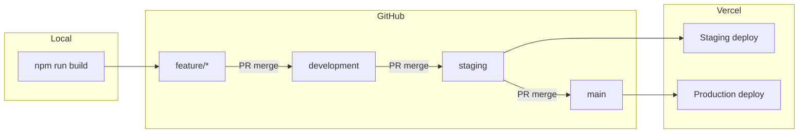

# Git, Development & Deployment Guide

**Project:** Leadora Systems marketing website  
**Stack:** GitHub → Vercel → Hostinger DNS (production domain when ready)  
**Form data:** Google Sheets (Apps Script)

This document matches the **current repo workflow** (as of the production release via PR #16):

```text
feature/*  →  development  →  staging  →  main
```

---

## Table of contents

1. [Big picture](#1-big-picture)
2. [Branches & environments](#2-branches--environments)
3. [Development workflow](#3-development-workflow) — local work, new features, PRs
4. [Deployment workflow](#4-deployment-workflow) — staging QA, production release
5. [Git command reference](#5-git-command-reference) — when to use which command
6. [Vercel configuration](#6-vercel-configuration)
7. [Environment variables](#7-environment-variables)
8. [After a production release](#8-after-a-production-release)
9. [Troubleshooting](#9-troubleshooting)
10. [Roles checklist](#10-roles-checklist)

---

## 1. Big picture

### Development vs deployment (two different concerns)

| Concern | What it is | Where it happens |
|---------|------------|------------------|
| **Development** | Writing code, feature branches, merging into `development` | Local machine + GitHub PRs to `development` |
| **Deployment** | Moving tested code to staging/production URLs | PRs `development` → `staging` → `main` + Vercel |

### Full pipeline diagram



### One-line summary

```text
Develop on feature/* → integrate in development → QA on staging → ship on main
```

---

## 2. Branches & environments

| Branch | Purpose | Merge target | Typical Vercel deploy |
|--------|---------|--------------|------------------------|
| `feature/*` | One task (e.g. `feature/contact-map`) | `development` | - |
| `development` | Integration branch for all in-progress features | `staging` | - |
| `staging` | Pre-production QA | `main` | **Staging** https://leadora-website.vercel.app/|
| `main` | Live production code | — | **Production** https://www.leadorasystems.com/


### Rules (do not skip)

1. **Never** push directly to `main` (use PR + review).
2. **Always** branch new work from `development`, not from `staging` or `main`.
3. **Never** merge `staging` into a feature branch (wrong direction).
4. Release order: `development` → `staging` → test → `main`.
5. After merging to `main`, **sync** `staging` and `development` with `main` (see [§8](#8-after-a-production-release)).
6. Delete merged `feature/*` branches on GitHub (0 ahead of `main`) to reduce clutter.

---

## 3. Development workflow

Use this section **before and during** feature implementation.

### 3.1 Prerequisites (once per machine)

```bash
git clone https://github.com/leadora-systems/leadora-website.git
cd leadora-website
npm install
cp .env.example .env.local
```

Local app: `npm run dev` → `http://localhost:3000`

Before every new feature, confirm the build passes:

```bash
npm run lint
npm run build
```

### 3.2 Before starting a new feature (sync `development`)

**Why:** You start from the latest integrated code, not stale branches.

```bash
git checkout development
git pull origin development
git status
```


### 3.3 Create a feature branch

**Why:** Keeps `development` stable; one PR per task.

```bash
git checkout -b feature/short-description
```

Naming examples: `feature/contact-map`, `bugfix/form-validation`

### 3.4 During implementation (daily loop)

```bash
# run locally
npm run dev

npm run lint
npm run build

# see what changed
git status

# save work
git add path/to/file.tsx
# or
git add .

git commit -m "feat: add map section to contact page"

# push feature branch (first time)
git push -u origin feature/short-description

# later pushes on same branch
git push
```

**Before Commit & Pushing**, run:

```bash
npm run lint
npm run build
```

### 3.5 Open PR: feature → `development`

1. GitHub → **New pull request**  
   - **Base:** `development`  
   - **Compare:** `feature/short-description`
2. Fill title + description; link issue/ticket if any.

3. Request review → address comments → **Merge** when approved.

**Do not** merge feature branches into `staging` or `main` directly.

### 3.6 Keep feature branch updated (if `development` moved)

**Why:** Reduces merge conflicts when your PR stays open several days.

```bash
git checkout feature/short-description
git fetch origin
git merge origin/development
# resolve conflicts if any, then:
git add .
git commit -m "chore: merge development into feature branch"
git push
```


### 3.7 Resolve merge conflicts (feature or PR)

1. Open conflicted files; remove `<<<<<<<`, `=======`, `>>>>>>>` markers.
2. Or use editor: **Accept Current / Incoming / Both**.
3. Stage and commit:

```bash
git add .
git commit -m "chore: resolve merge conflicts with development"
git push
```

To **cancel** a bad merge attempt:

```bash
git merge --abort
```

---

## 4. Deployment workflow

Use this section when a **batch of features** on `development` is ready for QA and production.

### 4.1 Promote to staging (PR: `development` → `staging`)

**Why:** Staging is the shared QA environment before customers see changes.

```bash
# optional: verify development is ready locally
git checkout development
git pull origin development
npm run build
```

On GitHub:

1. **New PR:** base `staging` ← compare `development`
2. Title example: `Promote development to staging — [release name]`
3. Review diff size; run through test plan on **staging URL** after merge.
4. **Merge** when QA sign-off is done.

Vercel deploys the `staging` branch automatically.

### 4.2 QA on staging (checklist)

- [ ] Home, About, Services, Portfolio, Careers, Contact
- [ ] Contact form → Google Sheets
- [ ] Careers apply + resume upload
- [ ] Mobile layout on key pages
- [ ] `npm run build` passed on the branch before merge (CI/Vercel)

### 4.3 Release to production (PR: `staging` → `main`)

**Why:** `main` is the only branch that should trigger production.

1. **New PR:** base `main` ← compare `staging`
2. Title example: `Production release: [summary]`
3. Require approval (PM + engineer as per team rules).
4. **Merge** → Vercel **production** deploy starts.
5. Smoke-test production URL after deploy is **Ready**.

### 4.4 Merge commit dialog (GitHub)

When merging on GitHub:

| Field | What to use |
|-------|-------------|
| **Commit message** | Default `Merge pull request #N from ...` is fine |
| **Extended description** | Short release note (what shipped, PR link) |

### 4.5 Emergency rollback (production)

| Method | When |
|--------|------|
| Vercel → Deployments → last good deploy → **Promote to Production** | Fastest rollback |
| Revert commit on `main` + new PR | Permanent fix in git history |

---

## 5. Git command reference

Quick lookup for developers. **Why** matters more than memorizing syntax.

### 5.1 Setup & clone

| Command | When to use | Why |
|---------|-------------|-----|
| `git clone <url>` | First time on a machine | Gets full repo + history |
| `git config --global user.name "..."` | Once per machine | Commits show correct author |
| `git config --global user.email "..."` | Once per machine | Matches GitHub account |

### 5.2 Sync & inspect

| Command | When to use | Why |
|---------|-------------|-----|
| `git fetch origin` | Before starting work / before merge | Updates remote refs without changing your files |
| `git pull origin development` | On `development` before new branch | Fast-forward to latest integration branch |
| `git status` | Often | Shows changed files and branch |
| `git branch` | Check current branch | Local branches only |
| `git branch -a` | See all branches | Includes `remotes/origin/...` |
| `git log --oneline -10` | Recent history | Debug what landed recently |
| `git diff` | Before commit | Review unstaged changes |
| `git diff --staged` | After `git add` | Review what will be committed |

### 5.3 Branching & switching

| Command | When to use | Why |
|---------|-------------|-----|
| `git checkout development` | Switch to integration branch | Base for new work |
| `git checkout -b feature/name` | Start new feature | Creates branch from current HEAD |
| `git switch development` | Same as checkout (newer syntax) | Clearer intent |
| `git switch -c feature/name` | Create + switch branch | Same as `checkout -b` |

### 5.4 Save & share work

| Command | When to use | Why |
|---------|-------------|-----|
| `git add <file>` | Stage specific files | Precise commits |
| `git add .` | Stage all changes | Faster; review with `git diff --staged` |
| `git commit -m "message"` | Save snapshot locally | Must follow team message style |
| `git push -u origin feature/name` | First push of branch | Sets upstream tracking |
| `git push` | After first push | Sends commits to GitHub |


### 5.5 Cleanup

| Command | When to use | Why |
|---------|-------------|-----|
| `git branch -d feature/name` | After merge, locally | Deletes local branch |
| `git push origin --delete feature/name` | After merge, on GitHub | Removes remote branch |
| `git checkout development && git pull` | After deleting feature branch | Return to integration branch |

**Safe to delete remote `feature/*` when:** PR is **Merged** and branch shows **0 ahead** of `main` on GitHub Branches page. Deleting does **not** remove merged PR history or code on `main`.


### 5.6 Commit message conventions (recommended)

```text
feat: new contact map section
fix: contact form Suspense build error
chore: merge development into feature branch
docs: update deployment pipeline
```

---

## 6. Vercel configuration

**Vercel → Project → Settings**

| Setting | Value |
|---------|--------|
| **Production Branch** | `main` |
| **Staging branch deploys** | Pushes to `staging` |


### Branch → URL (typical)

| Branch | Environment |
|--------|-------------|
| `main` | Production (`https://www.leadorasystems.com/) |
| `staging` | Staging (`https://leadora-website.vercel.app/) |


### What Vercel runs on each deploy

| Step | Command | Fails if |
|------|---------|----------|
| Install | `npm install` | Dependency error |
| Build | `next build` | TypeScript / Next.js error |
| Deploy | Upload assets + serverless routes | Invalid build output |

---

## 7. Environment variables

**Vercel → Settings → Environment Variables**

| Variable | Production | Preview | Local (`.env.local`) |
|----------|:----------:|:-------:|:--------------------:|
| `GOOGLE_SHEETS_WEB_APP_URL` | ✓ | ✓ | optional (console fallback) |
| `GOOGLE_SHEETS_SECRET` | ✓ | ✓ | optional |
| `NEXT_PUBLIC_SITE_URL` | production URL | staging/preview URL | `http://localhost:3000` |

Setup: `docs/google-sheets-setup.md`

**Tip:** Use one spreadsheet for MVP, or separate sheet URLs for Preview vs Production to avoid test rows in production.

---

## 8. After a production release

When `staging` → `main` is merged (production ship):

### 8.1 Sync `staging` with `main`

**Why:** Staging was 1 commit behind `main` after merge (merge commit exists only on `main`).

```bash
git checkout staging
git pull origin staging
git merge origin/main
git push origin staging
```

### 8.2 Confirm `development` matches `main`

**Why:** Next features should not reintroduce old code.

```bash
git checkout development
git pull origin development
git merge origin/main
git push origin development
```

### 8.3 Delete merged feature branches

On GitHub → Branches → delete `feature/*` with **0 ahead** of `main`.

### 8.4 Start next development phase

```bash
git checkout development
git pull origin development
git checkout -b feature/next-task
```

---

### GitHub branch protection (recommended)

- [ ] `main`: require PR, require status checks, no direct push
- [ ] `staging`: require PR (optional)
- [ ] `development`: optional PR rules for teams with multiple devs

### Vercel checklist (once)

- [ ] Repo connected
- [ ] Production branch = `main`
- [ ] Env vars for Production + Preview
- [ ] (Later) Production domain on `main`, staging domain on `staging`

---

## Quick reference card

```text
NEW FEATURE
  git checkout development && git pull
  git checkout -b feature/name
  npm run dev → commit → push → PR → development

RELEASE
  PR development → staging → QA on staging URL
  PR staging → main → smoke test production
  sync staging + development from main
  delete merged feature/* branches
```

---

**Related docs:** `README.md`, `docs/google-sheets-setup.md`

